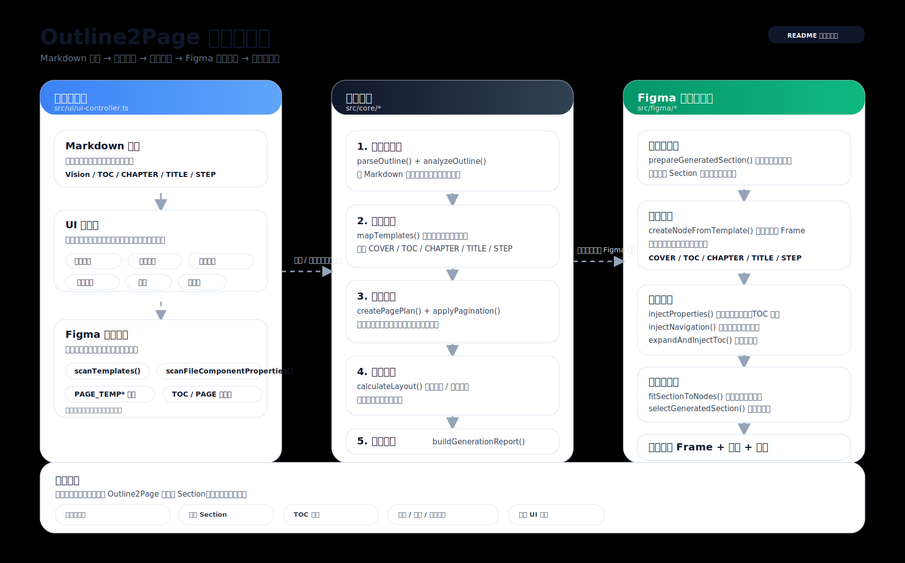

# Outline2Page

Figma plugin for turning structured Markdown outlines into reusable, coverable, and reportable page frames.



## Languages

- [中文说明](README.zh-CN.md)
- [English](README.en.md)

## What it does

- Parses Markdown outlines into `COVER / TOC / CHAPTER / TITLE / STEP` page structure.
- Scans `PAGE_TEMP:` or `PAGE_TEMP：` templates from the active Figma page.
- Maps required page kinds to available templates.
- Clones template frames, injects content, and applies page naming and layout.
- Writes chapter, title, step, page number, TOC, show, highlight, and type properties.
- Expands TOC rows when template capacity is not enough.
- Overwrites the previous generated Section on each run.
- Returns parse warnings, generation warnings, and a final report in the UI.

## Quick start

1. Prepare a Markdown outline.
2. Create template frames in Figma with `PAGE_TEMP` names.
3. Open the plugin and paste the outline.
4. Review the parsed structure and template mapping.
5. Click generate.

## Development

```bash
npm install
npm run build
npm test
npm run typecheck
npm run lint
```

## Repository map

- `src/core/` core parsing, planning, layout, naming, reporting
- `src/figma/` Figma API adapters
- `src/ui.html` plugin UI
- `tests/` core, Figma, and integration tests
- `docs/outline2page-architecture.svg` repo overview diagram

## License

UNLICENSED
